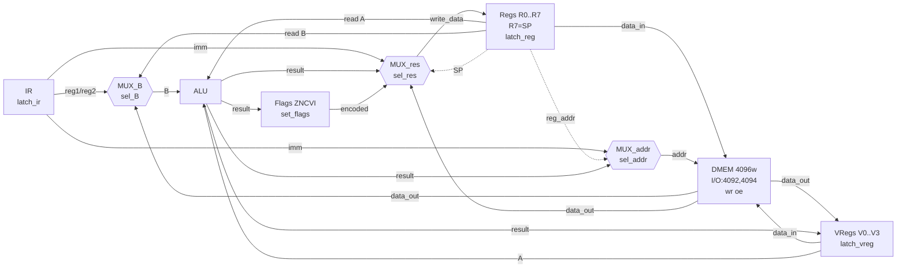
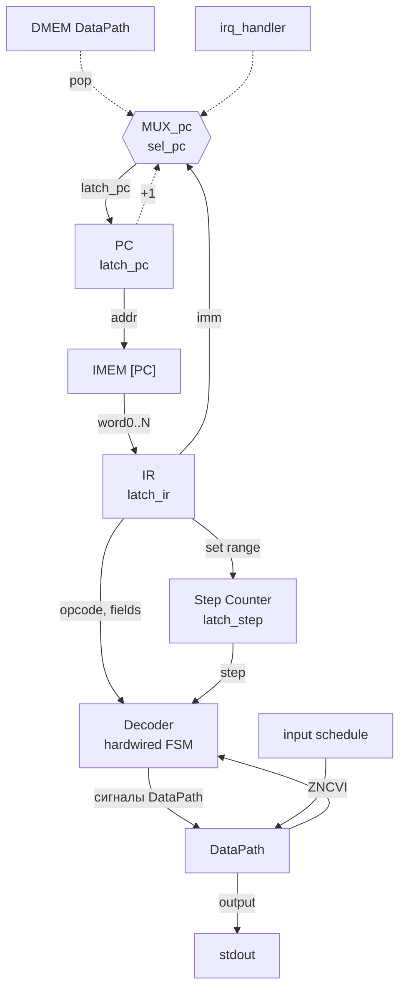

# Лабораторная работа 4: Модель процессора

**ФИО:** Швецов Егор Максимович

**Группа:** P3206

**Вариант:** `alg | cisc | harv | hw | tick | binary | trap | mem | pstr | prob1 | vector`

---

## Язык программирования

### Синтаксис

Расширенная форма Бэкуса-Наура:

```ebnf
program        ::= stmt* EOF

stmt           ::= var_decl | if_stmt | while_stmt | func_def | return_stmt
               |   print_stmt | printnum_stmt | printu_stmt | putc_stmt
               |   irq_def | assign_stmt | expr_stmt

var_decl       ::= "var" IDENT ("[" NUM "]")? ("=" expr)? ";"
if_stmt        ::= "if" "(" expr ")" block ("else" block)?
while_stmt     ::= "while" "(" expr ")" block
func_def       ::= "func" IDENT "(" param_list? ")" block
return_stmt    ::= "return" expr? ";"
irq_def        ::= "irq" IDENT block
assign_stmt    ::= lhs "=" expr ";"
expr_stmt      ::= expr ";"

print_stmt     ::= "print" "(" expr ")" ";"
printnum_stmt  ::= "printnum" "(" expr ")" ";"
printu_stmt    ::= "printu" "(" expr ")" ";"
putc_stmt      ::= "putc" "(" expr ")" ";"

block          ::= "{" stmt* "}"
param_list     ::= IDENT ("," IDENT)*
lhs            ::= IDENT | IDENT "[" expr "]"

expr           ::= or_expr
or_expr        ::= and_expr ("||" and_expr)*
and_expr       ::= eq_expr ("&&" eq_expr)*
eq_expr        ::= cmp_expr (("==" | "!=") cmp_expr)*
cmp_expr       ::= add_expr (("<" | ">" | "<=" | ">=") add_expr)*
add_expr       ::= mul_expr (("+" | "-") mul_expr)*
mul_expr       ::= unary_expr (("*" | "/" | "%") unary_expr)*
unary_expr     ::= ("-" | "!") unary_expr | primary
primary        ::= NUM | STR | CHR | IDENT ("(" arg_list? ")")? | IDENT "[" expr "]" | "(" expr ")"
arg_list       ::= expr ("," expr)*

NUM   ::= [0-9]+
STR   ::= '"' ([^"\\] | '\\' ['n','t','\\','"'])* '"'
CHR   ::= "'" ([^'\\] | '\\' ['n','t','\\',''', '0']) "'"
IDENT ::= [a-zA-Z_][a-zA-Z0-9_]*
```

### Семантика

- `var x = expr;` — объявить переменную `x` в статической памяти и инициализировать значением `expr`. Без инициализации переменная принимает значение 0
- `var a[N];` — объявить массив из `N` элементов в статической памяти. Элементы инициализируются нулём
- `x = expr;` — вычислить `expr` и записать результат в переменную `x`
- `a[i] = expr;` — вычислить `expr` и записать результат в элемент массива `a` по индексу `i`
- `if (expr) { ... } else { ... }` — если `expr` не равно 0, выполнить первый блок; иначе — второй (необязательный)
- `while (expr) { ... }` — пока `expr` не равно 0, выполнять блок
- `func name(params) { ... return expr; }` — определить функцию. Вызов — `name(args)`. Результат функции — значение `expr` в `return`
- `return expr;` — вернуть значение `expr` из функции. Без `expr` — вернуть 0
- `print(expr)` — вывести строку (Pascal-строка по адресу `expr`)
- `printnum(expr)` — вывести знаковое десятичное число
- `printu(expr)` — вывести беззнаковое десятичное число
- `putc(expr)` — вывести символ по коду
- `carry()` — вернуть флаг переноса (0 или 1) после предыдущей арифметической операции
- `irq handler { ... }` — определить обработчик прерывания. Ядро обработчика (сохранение/восстановление R0–R2, чтение INPUT_DATA, запись в буфер) генерируется автоматически

**Векторные функции:**

- `vload(vn, var)` — загрузить 4 элемента из памяти (начиная с адреса переменной `var`) в векторный регистр `Vn`
- `vstore(var, vn)` — сохранить векторный регистр `Vn` в память (начиная с адреса переменной `var`)
- `vadd(vn, vm)` — `Vn[i] += Vm[i]` для всех `i`
- `vsub(vn, vm)` — `Vn[i] -= Vm[i]` для всех `i`
- `vmul(vn, vm)` — `Vn[i] *= Vm[i]` для всех `i` (знаковое умножение)
- `vdiv(vn, vm)` — `Vn[i] /= Vm[i]` для всех `i`
- `vcmp(vn, vm)` — сравнить векторы, установить флаги по первому несовпадающему элементу
- `vset(vn, val)` — установить все 4 элемента `Vn` в значение `val`
- `vscalar(vn, reg, idx)` — `Vn[idx] = reg`
- `vget(vn, idx)` — прочитать `Vn[idx]`, результат в R0

### Типы и литералы

- **Целые числа** — 32-битные знаковые. Литерал: `42`, `0`, `-100`
- **Символы** — целое число, равное коду символа. Литерал: `'A'`, `'\n'`, `'\0'`
- **Строки** — последовательность символов. Литерал: `"hello\n"`. В памяти хранятся как Pascal-строка: `[длина][символ1]...[символN]`
- **Булевы значения** — целочисленные: 0 = ложь, не-0 = истина

### Область видимости

Статическая (лексическая). Переменные функции префиксируются именем функции (например, `func.x`) и размещаются в статической памяти. Глобальные переменные не имеют префикса. Все переменные доступны из любой точки программы после их объявления.

### Порядок вычисления

Аппликативная стратегия (eager): аргументы функций вычисляются до вызова. Выражения вычисляются слева направо с учётом приоритета операторов.

### AST

Транслятор строит AST, выводимое в файл `.ast` для верификации:

```
Program
  VarDecl(x, None, BinOp(+, Num(1), Num(2)))
  ExprStmt(FuncCall(printnum, [VarRef(x)]))
```

### Отображение выражений на регистры

Все выражения вычисляются в R0. Промежуточные значения сохраняются через `PUSH`/`POP`. CISC-инструкции позволяют сократить код: `ADDM` (память-регистр), `ADDI` (непосредственный), `POLY` (многочлен одной инструкцией). Пример: `a*b + c*d + e*f` → `LDI R0, 0; POLY R0, 3, (a,c), (b,d), (e,f)` вместо 5 умножений+сложений.

---

## Организация памяти

### Модель памяти

Архитектура Гарварда: раздельные памяти команд и данных. Размер машинного слова — 32 бита. Адресация — пословная.

- **Память команд:** 4096 слов (только чтение). Хранит инструкции, начиная с адреса 0
- **Память данных:** 4096 слов (чтение/запись). Хранит переменные, массивы, строки, стек, I/O порты

Минимальная единица данных — машинное слово (4 байта). Данные в памяти хранятся в формате Little-endian.

### Раскладка памяти данных

```
  ┌──────────────────────────────────────────────────────────┐
  │      0    read_idx                  Индекс чтения буфера │
  │      1    write_idx                 Индекс записи буфера │
  │      2    input_buffer[0]                                │
  │    ...    ...                       Входной буфер        │
  │    257    input_buffer[255]         (256 слов)           │
  ├──────────────────────────────────────────────────────────┤
  │    258    data_alloc_start                               │
  │    ...    переменные, массивы,      Данные пользователя  │
  │           строки (pstr)             (pstr формат)        │
  │                                  
  │    ...                                                   │
  ├──────────────────────────────────────────────────────────┤
  │                                     Свободная область    │
  ├──────────────────────────────────────────────────────────┤
  │   4091    SP (стек растёт вниз)    Стек (R7 = SP)        │
  │    ...    ...                                            │
  ├──────────────────────────────────────────────────────────┤
  │   4092    INPUT_DATA  (0xFFC)      Memory-mapped I/O     │
  │   4093    INPUT_AVAIL (0xFFD)      1 = данные готовы     │
  │   4094    OUTPUT_DATA (0xFFE)      Запись - вывод        │
  │   4095    OUTPUT_READY(0xFFF)      (зарезервировано)     │
  └──────────────────────────────────────────────────────────┘
```

### Размещение сущностей в памяти

**Литералы:**

- Целочисленные литералы, укладывающиеся в 16 бит (0..65535), кодируются как непосредственный операнд `imm16` в команде `LDI`
- Целочисленные литералы, не укладывающиеся в 16 бит, кодируются в двусловной команде `LDI` (32-битный `imm` во втором слове)
- Символьные литералы (`'A'`) преобразуются в код символа и обрабатываются как целые числа
- Строковые литералы размещаются в статической памяти данных как Pascal-строки: `[длина][символ1]...[символN]`. Каждый символ занимает одно слово. Инициализация выполняется в начале entry-кода через `LDI` + `ST`

**Константы:**

- Отдельный тип констант отсутствует. Константы обрабатываются как литералы (непосредственные операнды)

**Переменные:**

- Переменные отображаются на статическую память данных, начиная с адреса 258. Регистры не выделяются переменным
- Все операции выполняются через R0 (результат) и R1–R2 (временные). Значение загружается (`LD`), вычисляется, сохраняется (`ST`)
- При нехватке регистров промежуточные значения сохраняются на стек (`PUSH`/`POP`)
- Локальные переменные функций префиксируются именем функции (`func.x`) и размещаются в статической памяти

**Массивы:**

- Выделяется непрерывная область памяти (size слов). Доступ через `LD_IND`/`ST_IND` с вычислением адреса: `база + индекс`

**Инструкции:**

- Размещаются в памяти команд последовательно, начиная с адреса 0. Порядок: обработчик прерываний → библиотечные функции → пользовательский код (entry point). Метки разрешаются на этапе fixup

**Процедуры:**

- Код процедуры размещается в памяти команд. Вызов — `CALL` (push PC, jump). Возврат — `RET` (pop PC)
- Первый аргумент передаётся через R0 и сохраняется в статическую память в начале функции
- Второй аргумент передаётся через R1 → R2 → R0

**Прерывания:**

- Обработчик прерываний размещается по фиксированному адресу (`irq_handler`)
- При прерывании: `push(PC)`, `push(flags)`, `I←0`, `PC ← irq_handler`
- Обработчик автоматически: сохраняет R0–R2, читает `INPUT_DATA`, записывает в кольцевой буфер, увеличивает `write_idx`, сбрасывает `INPUT_AVAIL`, восстанавливает R0–R2, выполняет `IRET`
- Вложенные прерывания запрещены (флаг `in_irq`)

### Регистры

**Регистры общего назначения (8 штук, 32 бита):**

| Регистр | Назначение |
|---|---|
| R0 | Аккумулятор — результат всех вычислений |
| R1 | Временный регистр — правый операнд |
| R2 | Временный регистр — третий аргумент функции |
| R3–R6 | Свободные (не используются транслятором) |
| R7 | Указатель стека (SP) |

**Векторные регистры (4 штуки, каждый содержит 4 элемента по 32 бита):**

| Регистр | Назначение |
|---|---|
| V0–V3 | Векторные операции (SIMD) |

**Флаги (5 бит):**

| Флаг | Назначение |
|---|---|
| Z | Результат равен нулю |
| N | Результат отрицательный (старший бит = 1) |
| C | Перенос из старшего разряда (беззнаковый) |
| V | Арифметическое переполнение (знаковое) |
| I | Прерывания разрешены |

---

## Система команд

### Особенности процессора

- Архитектура CISC: переменная длина команд, память-регистр операции, непосредственные операнды, многочлен (POLY) с переменным числом слов, работа со специальными регистрами
- Гарвардская архитектура: раздельные памяти команд и данных
- Hardwired контроль: жёсткая логика (не микрокод)
- Ввод-вывод: memory-mapped (адреса 4092–4095), ввод по прерыванию (trap)

### Формат машинного кода

**Бинарный файл:**

```
┌────────────┬──────────────┬──────────────┬────────────────────────────┐
│  magic     │ entry_point  │ irq_handler  │ инструкции                 │
│  4 байта   │ 4 байта      │ 4 байта      │ (переменная длина)         │
│ 0x414C4731 │ LE           │ LE           │ LE, пословно               │
└────────────┴──────────────┴──────────────┴────────────────────────────┘
```

**Однословная инструкция (4 байта):**

```
┌────────┬──────┬──────┬──────────────┐
│ opcode │ reg1 │ reg2 │   imm16      │
│ 8 бит  │4 бит │4 бит │   16 бит     │
└────────┴──────┴──────┴──────────────┘
```

**Двусловная инструкция (8 байт):**

```
┌────────┬──────┬──────┬──────────────┐
│ opcode │ reg1 │ reg2 │   imm16      │  слово 0
│ 8 бит  │4 бит │4 бит │   16 бит     │
├────────┴──────┴──────┴──────────────┤
│            imm32                    │  слово 1
│            32 бита                  │
└────────────────────────────────────┘
```

**Инструкция POLY (переменная длина, (1+N) слов):**

```
┌────────┬──────┬──────┬──────────────┐
│ opcode │  rd  │  0   │     N        │  слово 0
│ 8 бит  │4 бит │4 бит │   16 бит     │
├────────┴──────┴──────┴──────────────┤
│       ci_addr       │     xi_addr   │  слово 1
│       16 бит        │     16 бит    │
├─────────────────────┼──────────────┤
│       ...           │     ...      │  ...
├─────────────────────┼──────────────┤
│       cN_addr       │     xN_addr  │  слово N
│       16 бит        │     16 бит   │
└─────────────────────┴──────────────┘
```

Кодирование полей:

- `opcode` — код операции (см. таблицу ниже)
- `reg1`, `reg2` — номера регистров (0–7 для R0–R7; 0–3 для V0–V3)
- `imm16` — младшие 16 бит непосредственного операнда (в однословных командах может использоваться как часть адреса)
- `imm32` — полное 32-битное значение (во втором слове двусловных команд)

### Набор команд

#### Управление потоком

| Мнемоника | Формат | Тактов | Код | Описание |
|---|---|---|---|---|
| `hlt` | 1W | 1 | 0x00 | Остановка процессора |
| `jmp addr` | 2W | 2 | 0x02 | PC ← addr |
| `jz addr` | 2W | 2 | 0x03 | PC ← addr если Z=1 |
| `jnz addr` | 2W | 2 | 0x04 | PC ← addr если Z=0 |
| `jg addr` | 2W | 2 | 0x05 | PC ← addr если Z=0 и N=0 |
| `jl addr` | 2W | 2 | 0x06 | PC ← addr если N=1 |
| `jge addr` | 2W | 2 | 0x07 | PC ← addr если N=0 |
| `jle addr` | 2W | 2 | 0x08 | PC ← addr если Z=1 или N=1 |
| `jc addr` | 2W | 2 | 0x0E | PC ← addr если C=1 |
| `call addr` | 2W | 3 | 0x09 | push(PC+wcs), PC ← addr |
| `ret` | 1W | 3 | 0x0A | PC ← pop() |
| `iret` | 1W | 3 | 0x0B | flags ← pop(), PC ← pop(), in_irq ← false |
| `sti` | 1W | 1 | 0x0C | I ← 1 |

#### Перемещение данных

| Мнемоника | Формат | Тактов | Код | Описание |
|---|---|---|---|---|
| `mov R1, R2` | 1W | 2 | 0x10 | R1 ← R2 |
| `ld R1, [addr]` | 2W | 3 | 0x11 | R1 ← mem[addr] |
| `st [addr], R1` | 2W | 3 | 0x12 | mem[addr] ← R1 |
| `ldi R1, imm` | 2W | 3 | 0x13 | R1 ← imm |
| `push R1` | 1W | 2 | 0x14 | mem[--SP] ← R1 |
| `pop R1` | 1W | 3 | 0x15 | R1 ← mem[SP++] |
| `ld R1, [R2]` | 1W | 3 | 0x16 | R1 ← mem[R2] (косвенная) |
| `st [R1], R2` | 1W | 3 | 0x17 | mem[R1] ← R2 (косвенная) |
| `movsp R1` | 1W | 1 | 0x18 | R1 ← SP |
| `ldsp R1` | 1W | 1 | 0x19 | SP ← R1 |
| `getflags R1` | 1W | 1 | 0x1A | R1 ← encode_flags() |
| `setflags R1` | 1W | 1 | 0x1B | decode_flags(R1) |

#### Арифметика и сравнение

| Мнемоника | Формат | Тактов | Код | Описание |
|---|---|---|---|---|
| `add R1, R2` | 1W | 2 | 0x20 | R1 ← R1 + R2, флаги |
| `sub R1, R2` | 1W | 2 | 0x21 | R1 ← R1 - R2, флаги |
| `mul R1, R2` | 1W | 3 | 0x22 | R1 ← R1 * R2 (знаковое), флаги |
| `div R1, R2` | 1W | 4 | 0x23 | R1 ← R1 / R2 (знаковое), флаги |
| `mod R1, R2` | 1W | 4 | 0x24 | R1 ← R1 % R2, флаги |
| `inc R1` | 1W | 1 | 0x25 | R1 ← R1 + 1, флаги |
| `dec R1` | 1W | 1 | 0x26 | R1 ← R1 - 1, флаги |
| `add R1, imm` | 2W | 3 | 0x27 | R1 ← R1 + imm, флаги |
| `sub R1, imm` | 2W | 3 | 0x28 | R1 ← R1 - imm, флаги |
| `mul R1, imm` | 2W | 4 | 0x29 | R1 ← R1 * imm, флаги |
| `cmp R1, R2` | 1W | 2 | 0x2A | Флаги ← R1 - R2 (без записи) |
| `cmp R1, imm` | 2W | 3 | 0x2B | Флаги ← R1 - imm (без записи) |

#### Поразрядная логика

| Мнемоника | Формат | Тактов | Код | Описание |
|---|---|---|---|---|
| `and R1, R2` | 1W | 2 | 0x30 | R1 ← R1 & R2, флаги |
| `or R1, R2` | 1W | 2 | 0x31 | R1 ← R1 \| R2, флаги |
| `not R1` | 1W | 1 | 0x33 | R1 ← ~R1, флаги |

#### CISC: память-регистр

| Мнемоника | Формат | Тактов | Код | Описание |
|---|---|---|---|---|
| `add R1, [addr]` | 2W | 4 | 0x40 | R1 ← R1 + mem[addr], флаги |
| `sub R1, [addr]` | 2W | 4 | 0x41 | R1 ← R1 - mem[addr], флаги |
| `mul R1, [addr]` | 2W | 5 | 0x42 | R1 ← R1 * mem[addr] (знаковое), флаги |
| `cmp R1, [addr]` | 2W | 4 | 0x43 | Флаги ← R1 - mem[addr] |

#### CISC: многочлен (переменная длина)

| Мнемоника | Формат | Тактов | Код | Описание |
|---|---|---|---|---|
| `poly R1, N, (c1,x1)...(cN,xN)` | (1+N)W | 2N+1 | 0x52 | R1 ← R1 + Σ ci·mem[xi] для i=1..N |

Кодирование: слово 0 = `[opcode:8][rd:4][0:4][N:16]`, слова 1..N = `[ci_addr:16][xi_addr:16]`

#### Векторные операции

| Мнемоника | Формат | Тактов | Код | Описание |
|---|---|---|---|---|
| `vload Vn, [addr]` | 2W | 6 | 0x60 | Vn[i] ← mem[addr+i], i=0..3 |
| `vstore [addr], Vn` | 2W | 6 | 0x61 | mem[addr+i] ← Vn[i], i=0..3 |
| `vadd Vn, Vm` | 1W | 3 | 0x62 | Vn[i] ← Vn[i] + Vm[i] |
| `vsub Vn, Vm` | 1W | 3 | 0x63 | Vn[i] ← Vn[i] - Vm[i] |
| `vmul Vn, Vm` | 1W | 4 | 0x64 | Vn[i] ← Vn[i] * Vm[i] (знаковое) |
| `vdiv Vn, Vm` | 1W | 5 | 0x65 | Vn[i] ← Vn[i] / Vm[i] |
| `vcmp Vn, Vm` | 1W | 3 | 0x66 | Флаги по первому несовпадению |
| `vset Vn, imm` | 2W | 4 | 0x67 | Vn[i] ← imm, i=0..3 |
| `vscalar Vn, Rm, idx` | 1W | 2 | 0x68 | Vn[idx&3] ← Rm |
| `vget R1, Vn, idx` | 1W | 2 | 0x69 | R1 ← Vn[idx&3] |

### Классификация CISC

Процессор классифицируется как CISC по следующим признакам:

1. **Переменная длина команды** — однословные (4 байта) и двусловные (8 байт) инструкции
2. **Операции регистр-память** — `ADDM`, `SUBM`, `MULM`, `CMPM` выполняют арифметику с операндом из памяти за одну инструкцию (без предварительной загрузки в регистр)
3. **Непосредственные операнды** — `ADDI`, `SUBI`, `MULI`, `CMPI`, `LDI` — арифметика и загрузка с константой в команде
4. **Инструкции с переменным числом аргументов и машинных слов** — POLY: кодирует N пар (коэффициент, переменная) в (1+N) машинных слов. Выборка инструкции производит явную смену машинного слова на каждом подтакте
5. **Сложные семантики** — `CALL` (push + jump), `PUSH`/`POP` (модификация SP + обращение к памяти), `IRET` (pop flags + pop PC + clear in_irq)
6. **Работа со специальными регистрами** — MOVSP, LDSP, GETFLAGS, SETFLAGS — прямой доступ к SP и регистру флагов

---

## Транслятор

Реализован в модуле: [translator](src/translator.py)

Интерфейс командной строки: `python -m src.translator <source.alg> <output.bin>`

Выходные файлы: `*.bin` (бинарный код), `*.asm` (дизассемблированный листинг `<addr> - <HEXCODE> - <mnemonic>`), `*.ast` (текстовое AST).

### Этапы трансляции

1. **Лексический анализ** — разбор на токены (числа, строки, идентификаторы, операторы, разделители). Пропуск комментариев `//`
2. **Синтаксический анализ** — рекурсивный спуск строит AST (узлы: Program, VarDecl, FuncDef, IrqDef, IfStmt, WhileStmt, ReturnStmt, BinOp, UnaryOp, Num, Str, VarRef, FuncCall, ...)
3. **Генерация кода** — обход AST: сбор переменных/массивов/строк с назначением адресов (от 258), генерация инструкций с метками, fixup (замена меток на адреса)

Порядок кода в памяти команд: обработчик прерываний → библиотечные функции (print, printnum, getc, ...) → пользовательские функции → entry point (инициализация строк, STI, основной код, HLT).

---

## Модель процессора

Интерфейс командной строки: `python -m src.simulator <binary.bin> <input.txt>`

Реализован в модуле: [simulator](src/simulator.py).

Архитектура модели: DataPath (пассивный) + ControlUnit (активный, hardwired FSM).

### DataPath

Реализован в классе [DataPath](src/simulator.py).



Сплошные линии — поток данных, пунктирные — управляющие сигналы. Сигналы `sel_*` и `latch_*` указаны в узлах MUX и защёлках.

MUX_B входы: `reg_B` (Regs), `data_out` (DMEM), `imm` (IR). MUX_res входы: `alu_result`, `data_out`, `imm`, `SP`, `flags`. MUX_addr входы: `imm`, `reg_addr`, `ALU(SP-1)`, `SP`.

### ControlUnit

Реализован в классе [ControlUnit](src/simulator.py). Hardwired FSM.



MUX_pc входы: `+1` (PC инкремент), `imm` (JMP/CALL), `pop` (RET/IRET из DMEM), `irq_handler`.

Цикл процессора (каждый подтакт = один tick):

1. **Fetch**: `sel_pc←+1; latch_pc` на каждый подтакт. После слова 0 — определить длину (POLY: 1+imm16). После последнего слова: `latch_ir`, перейти к exec
2. **Exec**: На последнем exec-такте: Control Logic генерирует сигналы DataPath + `sel_pc` для переходов
3. **IRQ** (между инструкциями): если `I && pending_irq && !in_irq`: `push(PC); push(flags); I←0; PC←irq_handler`

#### Обработка прерываний

Внешнее устройство по расписанию `[(tick, char_code)]` записывает данные в `INPUT_DATA`, устанавливает `INPUT_AVAIL=1` и `pending_irq=True`. ControlUnit проверяет IRQ между инструкциями. Вложенные прерывания запрещены (`in_irq`); pending IRQ обрабатывается после `IRET` + `STI`. `IRET`: `flags ← pop(); PC ← pop(); in_irq ← False`.

#### Формат лога

Каждый подтакт: `TICK:12 PC:15/1 R0=5 R1=0 SP=4090 F=00100 add R0, R1`. При прерывании добавляется `[IRQ]`.

---

## Тестирование

### Golden-тесты (YAML)

Эталонные тесты хранятся в формате YAML (каталог `tests/golden/`). Каждый файл содержит:

| Поле | Описание |
|---|---|
| `in_source` | Исходный код на языке `alg` |
| `in_stdin` | Расписание ввода (формат: `tick char_code`) |
| `out_code` | Бинарный машинный код (base64) — память команд |
| `out_code_hex` | Дизассемблированный листинг: `<addr> - <HEXCODE> - <mnemonic>` — память команд |
| `out_ast` | Текстовое AST (верификация трансляции) |
| `out_data_mem` | Дамп памяти данных (ненулевые ячейки) — память данных |
| `out_stdout` | Вывод программы |
| `out_log` | Журнал работы процессора (по одному подтакту на строку) |

Запуск: `pytest tests/test_golden_yaml.py -v`

Обновление эталонов: `pytest tests/test_golden_yaml.py -v --update-goldens`

### Обязательные тесты

| Тест | Программа | Ввод | Ожидаемый вывод | Описание |
|---|---|---|---|---|
| `hello` | `hello.alg` | (пусто) | `Hello World!\n` | Вывод строки |
| `cat` | `cat.alg` | `h e l l o` | `hello` | Эхо-ввод символов |
| `hello_user_name` | `hello_user_name.alg` | `Alice\n` | `What is your name?\nHello, Alice!\n` | Интерактивный ввод |
| `prob1` | `prob1.alg` | (пусто) | `906609\n` | Euler Problem 4 — наибольший палиндром |
| `sort` | `sort.alg` | `5 3 1 4 2 0` | `1 2 3 4 5 \n` | Сортировка пузырьком |
| `vector_demo` | `vector_demo.alg` | (пусто) | `11 22 33 44\n` | Векторное сложение |
| `poly_demo` | `poly_demo.alg` | (пусто) | `56\n` | POLY: `a*b+c*d+e*f` = 2·3+4·5+6·7 = 56 |
| `double_prec` | `double_prec.alg` | (пусто) | `hi=1 lo=0\n` | 64-битная арифметика с carry |
| `scalar_dot` | `scalar_dot.alg` | (пусто) | `300\n` | Скалярное произведение (цикл) |
| `vector_dot` | `vector_dot.alg` | (пусто) | `300\n` | Скалярное произведение (векторное) |

### Unit-тесты

106 модульных тестов в `tests/test_unit.py`: лексер, парсер, кодирование/декодирование, DataPath, ControlUnit (включая вложенные IRQ), ALU, транслятор, специальные регистры, POLY, пословная выборка, AST верификация.

Запуск: `pytest tests/test_unit.py -v`

### Пример использования

```bash
# Трансляция
$ python -m src.translator programs/hello.alg programs/hello.bin
source LoC: 1 code instr: 106

# Симуляция
$ python -m src.simulator programs/hello.bin programs/hello_input.txt
Hello World!

# Выходные файлы транслятора
# programs/hello.asm  — дизассемблированный листинг
# programs/hello.ast  — текстовое AST

# Выходные файлы симулятора
# programs/hello.log  — журнал работы процессора
```

### Сравнение скалярного и векторного скалярного произведения

Программа скалярного произведения двух 4-элементных векторов (`[10,20,30,40]` и `[1,2,3,4]`, результат 300):

| Реализация | Такты | Файл |
|---|---|---|
| Скалярная (цикл + `a[i]*b[i]`) | 676 | `scalar_dot.alg` |
| Векторная (`vload` + `vmul` + `vget`) | 433 | `vector_dot.alg` |
| **Ускорение** | **36%** | |

Векторная реализация быстрее за счёт:
- Одной инструкции `VMUL` вместо 4 итераций цикла (умножение + индексация + переходы)
- Инструкций `VLOAD` вместо 4 `LD` в цикле
- Отсутствия накладных расходов на управление циклом (сравнение, переход)

### Запуск всех тестов

```bash
pytest tests/ -v
```

CI: `.github/workflows/ci.yml` — ruff, mypy, pytest.
